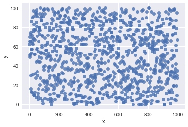

```python
import seaborn as sns; sns.set(color_codes=True)
```


```python
from random import randint as ri
```


```python
import pandas as pd
```


```python
data =[]
for i in range(0,1000):
    data.append((i,ri(0,100)))
```


```python
data_= []
for i in range(0, len(data)):
    data_.append(data[i][1])
```


```python
data__ =[]
for i in range(0, len(data)):
    data__.append(data[i][0])
```


```python
df = pd.DataFrame()
```


```python
se = pd.Series(data_)
df['y'] = se.values
```


```python
se_ = pd.Series(data__)
df['x'] = se_.values
```


```python
df
```


<div>
<style scoped>
    .dataframe tbody tr th:only-of-type {
        vertical-align: middle;
    }

    .dataframe tbody tr th {
        vertical-align: top;
    }

    .dataframe thead th {
        text-align: right;
    }
</style>
<table border="1" class="dataframe">
  <thead>
    <tr style="text-align: right;">
      <th></th>
      <th>y</th>
      <th>x</th>
    </tr>
  </thead>
  <tbody>
    <tr>
      <th>0</th>
      <td>62</td>
      <td>0</td>
    </tr>
    <tr>
      <th>1</th>
      <td>51</td>
      <td>1</td>
    </tr>
    <tr>
      <th>2</th>
      <td>70</td>
      <td>2</td>
    </tr>
    <tr>
      <th>3</th>
      <td>49</td>
      <td>3</td>
    </tr>
    <tr>
      <th>4</th>
      <td>65</td>
      <td>4</td>
    </tr>
    <tr>
      <th>5</th>
      <td>73</td>
      <td>5</td>
    </tr>
    <tr>
      <th>6</th>
      <td>52</td>
      <td>6</td>
    </tr>
    <tr>
      <th>7</th>
      <td>65</td>
      <td>7</td>
    </tr>
    <tr>
      <th>8</th>
      <td>30</td>
      <td>8</td>
    </tr>
    <tr>
      <th>9</th>
      <td>75</td>
      <td>9</td>
    </tr>
    <tr>
      <th>10</th>
      <td>16</td>
      <td>10</td>
    </tr>
    <tr>
      <th>11</th>
      <td>53</td>
      <td>11</td>
    </tr>
    <tr>
      <th>12</th>
      <td>13</td>
      <td>12</td>
    </tr>
    <tr>
      <th>13</th>
      <td>86</td>
      <td>13</td>
    </tr>
    <tr>
      <th>14</th>
      <td>57</td>
      <td>14</td>
    </tr>
    <tr>
      <th>15</th>
      <td>57</td>
      <td>15</td>
    </tr>
    <tr>
      <th>16</th>
      <td>12</td>
      <td>16</td>
    </tr>
    <tr>
      <th>17</th>
      <td>72</td>
      <td>17</td>
    </tr>
    <tr>
      <th>18</th>
      <td>63</td>
      <td>18</td>
    </tr>
    <tr>
      <th>19</th>
      <td>66</td>
      <td>19</td>
    </tr>
    <tr>
      <th>20</th>
      <td>90</td>
      <td>20</td>
    </tr>
    <tr>
      <th>21</th>
      <td>62</td>
      <td>21</td>
    </tr>
    <tr>
      <th>22</th>
      <td>31</td>
      <td>22</td>
    </tr>
    <tr>
      <th>23</th>
      <td>69</td>
      <td>23</td>
    </tr>
    <tr>
      <th>24</th>
      <td>91</td>
      <td>24</td>
    </tr>
    <tr>
      <th>25</th>
      <td>76</td>
      <td>25</td>
    </tr>
    <tr>
      <th>26</th>
      <td>97</td>
      <td>26</td>
    </tr>
    <tr>
      <th>27</th>
      <td>10</td>
      <td>27</td>
    </tr>
    <tr>
      <th>28</th>
      <td>68</td>
      <td>28</td>
    </tr>
    <tr>
      <th>29</th>
      <td>83</td>
      <td>29</td>
    </tr>
    <tr>
      <th>...</th>
      <td>...</td>
      <td>...</td>
    </tr>
    <tr>
      <th>970</th>
      <td>73</td>
      <td>970</td>
    </tr>
    <tr>
      <th>971</th>
      <td>80</td>
      <td>971</td>
    </tr>
    <tr>
      <th>972</th>
      <td>51</td>
      <td>972</td>
    </tr>
    <tr>
      <th>973</th>
      <td>19</td>
      <td>973</td>
    </tr>
    <tr>
      <th>974</th>
      <td>32</td>
      <td>974</td>
    </tr>
    <tr>
      <th>975</th>
      <td>81</td>
      <td>975</td>
    </tr>
    <tr>
      <th>976</th>
      <td>19</td>
      <td>976</td>
    </tr>
    <tr>
      <th>977</th>
      <td>34</td>
      <td>977</td>
    </tr>
    <tr>
      <th>978</th>
      <td>99</td>
      <td>978</td>
    </tr>
    <tr>
      <th>979</th>
      <td>98</td>
      <td>979</td>
    </tr>
    <tr>
      <th>980</th>
      <td>50</td>
      <td>980</td>
    </tr>
    <tr>
      <th>981</th>
      <td>29</td>
      <td>981</td>
    </tr>
    <tr>
      <th>982</th>
      <td>5</td>
      <td>982</td>
    </tr>
    <tr>
      <th>983</th>
      <td>27</td>
      <td>983</td>
    </tr>
    <tr>
      <th>984</th>
      <td>37</td>
      <td>984</td>
    </tr>
    <tr>
      <th>985</th>
      <td>74</td>
      <td>985</td>
    </tr>
    <tr>
      <th>986</th>
      <td>33</td>
      <td>986</td>
    </tr>
    <tr>
      <th>987</th>
      <td>61</td>
      <td>987</td>
    </tr>
    <tr>
      <th>988</th>
      <td>87</td>
      <td>988</td>
    </tr>
    <tr>
      <th>989</th>
      <td>42</td>
      <td>989</td>
    </tr>
    <tr>
      <th>990</th>
      <td>4</td>
      <td>990</td>
    </tr>
    <tr>
      <th>991</th>
      <td>56</td>
      <td>991</td>
    </tr>
    <tr>
      <th>992</th>
      <td>79</td>
      <td>992</td>
    </tr>
    <tr>
      <th>993</th>
      <td>19</td>
      <td>993</td>
    </tr>
    <tr>
      <th>994</th>
      <td>30</td>
      <td>994</td>
    </tr>
    <tr>
      <th>995</th>
      <td>95</td>
      <td>995</td>
    </tr>
    <tr>
      <th>996</th>
      <td>9</td>
      <td>996</td>
    </tr>
    <tr>
      <th>997</th>
      <td>35</td>
      <td>997</td>
    </tr>
    <tr>
      <th>998</th>
      <td>27</td>
      <td>998</td>
    </tr>
    <tr>
      <th>999</th>
      <td>67</td>
      <td>999</td>
    </tr>
  </tbody>
</table>
<p>1000 rows × 2 columns</p>
</div>


```python
sns.regplot(x='x', y='y', data =df, fit_reg=False)
```


    <matplotlib.axes._subplots.AxesSubplot at 0x10ee577f0>





```python
model = Sequential([
    Dense(100, input_shape=(1,)),
    Activation('relu'),
    Dense(10),
    Activation('softmax'),
])

# For a mean squared error regression problem
model.compile(optimizer='rmsprop',
              loss='mse')

# For custom metrics
import keras.backend as K

def mean_pred(y_true, y_pred):
    return K.mean(y_pred)

model.compile(optimizer='rmsprop',
              loss='binary_crossentropy',
              metrics=['accuracy', mean_pred])
```
